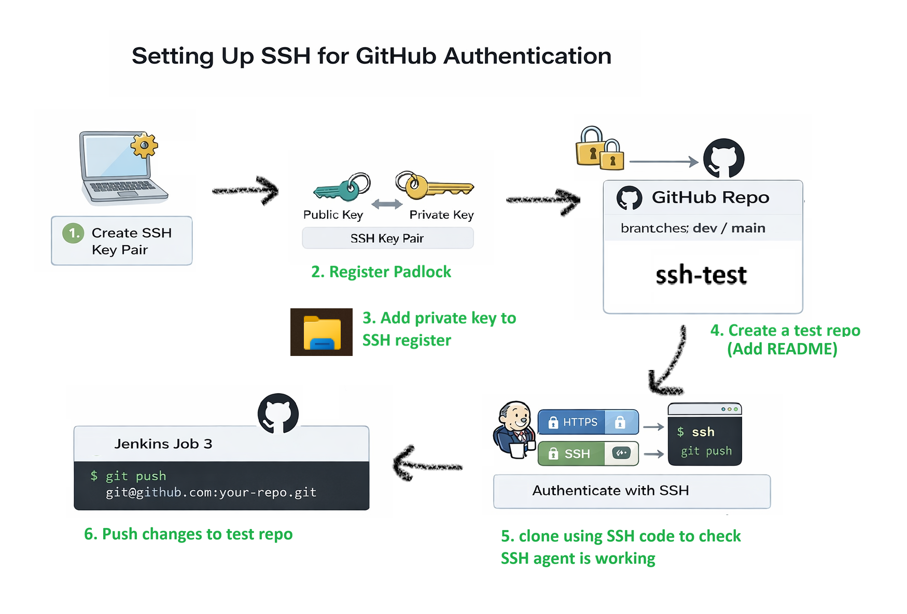

# Intro to CI/CD tools

Author: Anika Khan \
Project: tech515-sparta-test-app-cicd \
Tools: GitHub, Jenkins, AWS EC2, Nginx, Node.js, PM2 \
Pipeline Type: CI + CD (Continuous Integration + Continuous Deployment) \

- [Intro to CI/CD tools](#intro-to-cicd-tools)
  - [Intro](#intro)
  - [What is CI? Benefits?](#what-is-ci-benefits)
    - [Benefits:](#benefits)
  - [What is CD? Benefits?](#what-is-cd-benefits)
    - [Benefits:](#benefits-1)
    - [Continuous Delivery](#continuous-delivery)
    - [Continuous Deployment](#continuous-deployment)
  - [What is Jenkins?](#what-is-jenkins)
  - [Why use Jenkins? Benefits of using Jenkins?](#why-use-jenkins-benefits-of-using-jenkins)
  - [Stages of Jenkins](#stages-of-jenkins)
  - [What alternatives are there for Jenkins](#what-alternatives-are-there-for-jenkins)
  - [Why build a pipeline? Business value?](#why-build-a-pipeline-business-value)
  - [CICD Pipeline](#cicd-pipeline)
    - [Job 1 - Continuous Integration (CI: Test)](#job-1---continuous-integration-ci-test)
    - [Job 2 - Continuous Integration (CI: Merge)](#job-2---continuous-integration-ci-merge)
    - [Job 3 - Continuous Deployment (CD: Deploy)](#job-3---continuous-deployment-cd-deploy)
  - [Syncing to GitHub SSH](#syncing-to-github-ssh)
  - [JOB 1 - CI: Test on GitHub Push (Dev branch)](#job-1---ci-test-on-github-push-dev-branch)
    - [Create and Deploy Jenkins keys on GitHub](#create-and-deploy-jenkins-keys-on-github)
    - [Job 1 Jenkins Configuration](#job-1-jenkins-configuration)
    - [GitHub Webhook Setup (Job 1 trigger)](#github-webhook-setup-job-1-trigger)
  - [JOB 2 - Merging Dev and Main Branch](#job-2---merging-dev-and-main-branch)
    - [Job 2 Jenkins Configuration](#job-2-jenkins-configuration)
    - [Testing Job 2 on Git Bash](#testing-job-2-on-git-bash)
  - [JOB 3 - CD: Deploy main to AWS EC2 using rsync + pm2 restart](#job-3---cd-deploy-main-to-aws-ec2-using-rsync--pm2-restart)
    - [Job 3 Configuration](#job-3-configuration)
    - [Testing Job 3](#testing-job-3)


## Intro

CI/CD (Continuous Integration / Continuous Delivery or Deployment) is a modern DevOps practice that automates the process of integrating code, testing it, and deploying it safely.

In this project, a 3-stage Jenkins pipeline was built to:

1. Test code automatically
2. Protect the main branch
3. Deploy only tested code to a live EC2 instance

This pipeline ensures that every production deployment is traceable, repeatable, and automated.


## What is CI? Benefits?
- Continuous Integration
- merging code
- Triggered by: Developers frequently pushing the code changes to shared repo
- Tests are run automatically omn the code before it is integrated into the main code

### Benefits:
- Help you to identify and resolve bugs
  - Reduces costs
- Helps to maintain a stable and functional software build

## What is CD? Benefits?
Can mean:
  - **Continuous Delivery** (manual sign off/approval)
  - (OR) **Continuous Deployment** (automatically deploys code to production)

### Benefits:
### Continuous Delivery
- Ensure software is always in a deployable state, ready/can be pushed production any time
- Often involve producing deployable artifact
- Requires a manual release decision

### Continuous Deployment
- Extends Continuous Delivery by automating the final stop or deploying to production
- No manual intervention required
- Benefit which is also a disadvantage:
  - removes the human approval, relies entirely on automated processes

## What is Jenkins?
- automation server
- open-source
- primarily used for CICD, but can automate much more

## Why use Jenkins? Benefits of using Jenkins?
- Benefits:
  - Automation
  - Extensibility: Jenkins has over 1800 plugins
  - Scalability: Jenkins server can scale easily by adding/using worker nodes/agents to run jobs
  - Community support
  - Cross-platform: Works across Windows, Linux, MacOS

- Disadvantages:
  - Can be complex setup for beginners
  - Maintenance Overhead
  - Can be resource-intensive when running multiple jobs
  - Outdated user interface compared to modern tools

## Stages of Jenkins
A typical Jenkins CICD pipeline involves the following stages:
1. Source Code Management (SCM)
2. Build: Compile the code, build into executable artifact 
3. Test: Automated tests (unit, integration, etc)
4. Package: Package into deployable artifact
5. **(If using Continuous Deployment (CD))** then the package is deployed into the target environment, e.g. test, production
6. **(If using Continuous Deployment (CD))** Monitor: Monitoring tools may be deployed/configured to observe performance, log issues, etc. after deployment

## What alternatives are there for Jenkins
- GitLab CI
- GitHub Actions
- Circle CI
- Travis CI
- Bamboo
- Teamcity
- GoCD
- Azure DevOps (Azure Pipelines to run the CICD pipelines)

## Why build a pipeline? Business value?

- cost savings - automating repetitive proccesses
- faster time to market
- reduced risk
- improved quality through continuous feedback and improvement 
  
## CICD Pipeline

<!--  -->


- Trigger: `git push` (Developer Action)

**What happens?**
- A developer makes a change locally (usually on dev)
- Runs:
    ```
    git add .
    git commit -m "change"
    git push
    ```

**Why?**
- Developers should never deploy manually
- Code changes must flow through automation, not humans:
**CI/CD needs a webhook - it should react to code changes, not manual clicks**


### Job 1 - Continuous Integration (CI: Test)
- Triggered by GitHub Webhook on push
- **What Job 1 does:**
   1. Jenkins pulls the codeRuns automated tests (or basic validation for now)
   2. Confirms the code works in isolation
- **Why this exists:**
  1. Prevents broken code from ever reaching main
  2. Catches errors early
  3. Makes CI a quality gate

### Job 2 - Continuous Integration (CI: Merge)
- Triggered by Job 1 finishing successfully
- **What Job 2 does:**
  1. Fetches latest remote branches
  2. Resets local main to match GitHub
  3. Merges dev into main
  4. Pushes the updated main back to GitHub
- **Why this is important:**
  1. Merges are automated
  2. No developer manually merges untested code
  3. Guarantees main is always tested, clean and deployable: **Only merge when tests pass - otherwise the pipeline stops**

### Job 3 - Continuous Deployment (CD: Deploy)

- Triggered by Job 2 finishing successfully
- **What Job 3 does:**
  1. Copies the tested code from Jenkins → EC2 using rsync
  2. Does not use git clone on EC2 
  3. Restarts the app using PM2
  4. Application updates live automatically
- **Why this is CD:**
  1. No manual SSH
  2. No manual restart
  3. No copying files by hand
  4. The moment main changes, production updates: **CD is about removing humans from deployment**

## Syncing to GitHub SSH

<!--  -->



To allow secure interaction between the local machine, GitHub, and Jenkins, SSH authentication was configured.
We first generate the SSH key for GitHub...

  cd .ssh
  ssh-keygen -t rsa -b 4096 -C "anikakhn@outlook.com"

Check if the key was created...

    ls

Print out your public key, ensure `.pub` 
  
    cat anika-github-key.pub

Log into github -> Settings -> SSH and GCP keys -> Add new SSH key:
    - name: anika-github-key (private key)
    - key: - the public key you get after running `cat anika-github-key.pub` above.

Checking if github repo is connected and synced to the terminal

    eval `ssh-agent -s`

You should see an agent PID number, then it means the connection was successful. Now add your SSH key...

    ssh-add anika-github-key

It should say "Identity added" with your email. Now to authenticate...

    ssh -T git@github.com

Should return "Hi [github username]! You've successfully authenticated...". \
Now it's time to create a new repo to test that SSH works: 
1. Go to GitHub -> New repository 
2. name it `test-ssh`
3. Tick: Add README
4. Select 'Create repository'

Copy the SSH code and run the following commands:

    cd ~
    cd Documents/github/
    git clone git@github.com:4niii/test-ssh.git
    cd test-ssh/
    ls

If the file is there with the README.md file, then amazing! Everything is working well so far.

    cat README.md

Should return `#test-ssh` which is the name of the repo. Now to check if we can push changes using SSH, let's edit the README file and push to test it...

    nano README.md

Make a change, then save it and exit the nano. Commit your changes and push.

    git add .
    git commit -m "Edited README file"
    git push

The changes should show up in the GitHub repo.


You can always switch back to https tab if you'd like to use that, but you would have to do the git add remote command to set the https remote repo. Right now we will be using SSH so we can utilise SSH agent to play with git.

<!-- We will be using the following diagram as guidance:
 -->

## JOB 1 - CI: Test on GitHub Push (Dev branch)

**Job 1 Objectives:** 

Whenever developers push to dev, Jenkins should: 
1. Pull the code
2. Install dependencies
3. Run tests
4. If tests pass -> trigger Job 2

> Before starting Job 1, ensure you create a Git repo: `tech515-sparta-test-app-cicd`, clone it to your github folder (C:\Users\3akim\Documents\github\tech515-sparta-test-app-cicd), and then we will be working with different branches for the following Job 1, 2 and 3 (Dev and Main)

### Create and Deploy Jenkins keys on GitHub
Before starting Job 1, we need to create keys to authorise Jenkins.
1. Go to your Git Bash terminal
2. Go to your SSH folder: `cd .ssh` 
3. Run: `ssh-keygen -t rsa -b 4096 -C "anikakhn@outlook.com"`
4. When prompted to enter file name: `anika-jenkins-github-key`
5. Press enter when prompted for passphrase.
6. Go to your GitHub repo `tech515-sparta-test-app-cicd` -> Settings -> Deploy keys (under Security) -> Add deploy key
7. Title: `anika-jenkins-github-key` (same as the key we just created)
8. Key -> Copy paste your public key, you may run on GitBash `cat anika-jenkins-github-key.pub` (ensure you specify the `.pub`)
9. Tick: Allow write access
10. Select 'Add key'

### Job 1 Jenkins Configuration 
1. On your Jenkins server, Dashboard -> New item -> Freestyle project
2. Job name: `anika-sparta-app-job1-ci-test`
3. Configuration:
   1. General
      1. Description: “CI test job triggered by GitHub webhook on dev branch.”
      2. Tick: Discard old builds
         1. Set Max # of builds to: 5 (Keeps the job neat and well maintained, keeps the latest 5 builds)
      3. Select GitHub Project -> Repository URL: `https://github.com/4niii/tech515-sparta-test-app-cicd/` (ensure you copy paste the HTTPS version, remove any `.git` at the end and replace it with a forward slash '/')
   2. Source Code Management
      1. Select: `Git`
      2. Repository URL: `git@github.com:4niii/tech515-sparta-test-app-cicd.git` (ensure you copy paste the SSH version)
      3. Credentials: `anika-jenkins-github-key`
         - If they don't exist, then you add a new one:
           1. Select 'Add' -> Jenkins (popup)
           2. Domain: Global credentials (unrestricted)
           3. Description: 'to read/write to repo'
           4. Kind: SSH Username with private key
           5. Scope: Global
           6. Username: anika-jenkins-github-key 
           7. ID: anika-jenkins-github-key (make it match with username, it's more helpful)
           8. Private Key -> Enter directly -> Copy paste your private key generated earlier, it should have 5 hyphens in the beginning and 5 hyphens in the end.
   3. Branch Specifier: `*/dev` (first time making it, you can set it to `*/main`, once Job 2 is complete ensure it is set on `*/dev`)
   4. Build Triggers
      1. Tick: GitHub hook trigger for GITScm polling (Do not use “Poll SCM” for this task - webhook is required.)
   5. Build Environments
      1. Tick: Provide Node & npm bin/ folder to PATH
      2. Choose Node JS version 20
   6. Build Steps
      1. Add build step -> Execute shell
      2. Use this as your Job 1 shell script: 
            ```
            cd app
            npm install
            npm test
            ```
   7. Post-build Actions
      1. Add post-build action -> Build other projects
   8. Project to build: `anika-job2-ci-merge` (only do this after JOB 2 is complete - follow instructions below)
        > Must remove commas after specifying the project name to avoid error
      1. Trigger only if build is stable 

### GitHub Webhook Setup (Job 1 trigger)

> GitHub Repo -> Settings -> Webhooks -> Add webhook: Payload URL: `http://<jenkins-url>/github-webhook/`
   - Tick: Enable SSL verification
   - Tick: Just the push event 
   - Tick: Active
   - Select 'Add webhook'


**Testing Job 1 and Webhook on Git Bash**
1. Step A: 
   1. Ensure you are `cd`-ed into your repo: C:\Users\3akim\Documents\github\tech515-sparta-test-app-cicd
   2. Create a Dev branch using `branch dev`
   3. Make a change on dev:
        ```
        git switch dev
        nano README.md
        ```
   4. Edit a line, save.

2. Step B: 
   1. Stage & commit
        ```
        git add .
        git commit -m "test ci trigger job1"
        ```

3. Step C: 
   1. Push to dev
        ```
        git push
        ```

**Expected results:** 
1. GitHub push triggers webhook
2. Job 1 starts automatically on Jenkins server

## JOB 2 - Merging Dev and Main Branch

**Job 2's Objectives:**
1. After Job 1 passes:
   1. Jenkins checks out main
   2. merges origin/dev into main
   3. pushes updated main back to GitHub
   4. triggers Job 3

**Why We Did This**
- Protects the main branch
- Ensures only tested code is merged
- Removes the need for manual merges
 
**Problem it solves:**
- Human error during merging
- Untested code reaching production-ready branches

### Job 2 Jenkins Configuration
1. On your Jenkins server, Dashboard -> New item -> Freestyle project
2. Job name: `anika-job2-ci-merge`
3. Configuration:
   1. General
      1. Description: “CI test job triggered by GitHub webhook on dev branch.”
      2. Tick: Discard old builds
         1. Set Max # of builds to: 5 (Keeps the job neat and well maintained, keeps the latest 5 builds)
      3. Select GitHub Project -> Repository URL: `https://github.com/4niii/tech515-sparta-test-app-cicd/` (ensure you copy paste the HTTPS version, remove any `.git` at the end and replace it with a forward slash '/')
   2. Source Code Management
      1. Select: `Git`
      2. Repository URL: `git@github.com:4niii/tech515-sparta-test-app-cicd.git` (ensure you copy paste the SSH version)
      2. Credentials: anika-jenkins-github-key
   3. Branch specifier: */main
   4. Build Triggers
      1. Tick: Build after other projects are built: `anika-sparta-app-job1-ci-test`
      2. Tick: Trigger only if build is stable 
            > Do NOT add webhook to Job 2 - the pipeline trigger requirement is already met through Job 1.
      3. Build Environment
         1. Tick: SSH Agent
         2. Credentials: anika-jenkins-github-key (Needed because Job 2 must push to GitHub.)
      4. Build Steps -> Execute shell:
        ```
        git fetch origin
        git checkout -B main origin/main
        git merge origin/dev
        git push origin main
        ``` 
        - `git fetch origin` -> Updates Jenkins’ local view of all remote branches (origin/dev, origin/main) without modifying any local code.
        - `git checkout -B main origin/main` -> Resets the local main branch to exactly match the remote origin/main, ensuring a clean, predictable merge state.
            - `-B` means:
               -  if <branch> does not exist locally -> create it. 
               - If <branch> already exists locally -> reset it to point to the given start-point.
        - `git merge origin/dev` -> Merges the latest tested changes from the remote dev branch into main.
        - `git push origin main` -> Pushes the newly merged main branch back to GitHub.
      5. Post-build Actions
         1. Build other projects: `anika-job3-cd-deploy`
         2. Tick: Trigger only if stable 

> Alternative - Jenkins Git Publisher plugin could be used instead of shell commands
 
**How to add Git Publisher plugin?**
   
1. Post build actions -> Add -> Git publisher 
2. Click 'push only if build succeeds'
3. Click 'merge results' -> Branches -> Branch to push: main -> target remote name: origin
4. Save 
5. Make sure to remove shell commands now

### Testing Job 2 on Git Bash

1. Step A: <br>
Make a change on dev (not on main)
    ```
    git switch dev
    nano app/views/index.ejs
    ```

    > Add timestamp line:
CI/CD Test: 23/12/2025 14:58

2. Step B: <br>
Commit + push to dev
    ```git add .
    git commit -m "Frontpage updated 14:58"
    git push
    ```

> Sometimes, when you do a push on dev branch, it does not recognise where the push need to happen. So to make it equivalent to the main branch, just run command `git push --set-upstream origin dev` on git bash.

**Expected Results:**

1. Job 1 runs tests and passes
2. Job 2 runs automatically
3. GitHub main branch now includes your change


## JOB 3 - CD: Deploy main to AWS EC2 using rsync + pm2 restart

**Job 3's Objectives:**
1. After Job 2 succeeds:
2. Jenkins takes its workspace code (main branch)
3. copies code to EC2 using rsync (NOT git clone)
4. installs dependencies on EC2
5. restarts app using pm2

> You need to have a running EC2 instance for this

1. Create an AWS EC2 instance
   - Ubuntu 22.04 LTS
   - Use normal SG rules, but allow from anywhere (to get it working initially) OR Jenkin worker nodes SG to allow Jenkins to SSH in (for better security):
   - Must have all dependencies / user data installed to run your app. If not, run the following script on the VM.
 
        ```
        #!/bin/bash
        
        # Update system
        sudo apt update -y
        sudo DEBIAN_FRONTEND=noninteractive apt upgrade -y
        
        # Install Nginx
        sudo apt install -y nginx
        sudo systemctl enable nginx
        sudo systemctl start nginx
        
        # Install Node.js 20
        curl -fsSL https://deb.nodesource.com/setup_20.x | sudo -E bash -
        sudo apt install -y nodejs
        
        # Install PM2 globally
        sudo npm install -g pm2
        ```

### Job 3 Configuration

1. On your Jenkins server, Dashboard -> New item -> Freestyle project
2. Job name: `anika-job3-cd-deploy`
3. Configuration:
   1. General
      1. Description: “CI test job triggered by GitHub webhook on dev branch.”
      2. Tick: Discard old builds
         1. Set Max # of builds to: 5 (Keeps the job neat and well maintained, keeps the latest 5 builds)
      3. Select GitHub Project -> Repository URL: `https://github.com/4niii/tech515-sparta-test-app-cicd/` (ensure you copy paste the HTTPS version, remove any `.git` at the end and replace it with a forward slash '/')
   2. Source Code Management
      1. Select: `Git`
      2. Repository URL: `git@github.com:4niii/tech515-sparta-test-app-cicd.git` (ensure you copy paste the SSH version)
      3. Credentials: anika-jenkins-github-key
   3. Branch specifier: */main
   4. Build Triggers
      1. Tick: Build after other projects are built: `anika-job2-ci-merge`
      2. Tick: Trigger only if stable
   5. Build Environment
      1. Tick: SSH Agent:
      2. Select EC2 key here: anika-aws.pem
         - If it doesn't exist, create it: (we need to add the private key credentials on Jenkins for Job 3 to access our EC2 instance)
           1. Select 'Add' -> Jenkins (popup)
           2. Domain: Global credentials (unrestricted)
           3. Description: 'private key to SSH into EC2 instance'
           4. Kind: SSH Username with private key
           5. Scope: Global
           6. Username: anika-aws.pem 
           7. ID: anika-aws.pem (make it match with username, it's more helpful)
           8. Private Key -> Enter directly -> Copy paste your private key generated earlier, it should have 5 hyphens in the beginning and 5 hyphens in the end.
   6. Build Steps -> Execute shell
   Use this script:
        ```
        rsync -av --delete -e "ssh -o StrictHostKeyChecking=no" \
        ./ ubuntu@[ec2-private-IP]:/home/ubuntu/app/
        
        ssh -o StrictHostKeyChecking=no ubuntu@[ec2-private-IP] << 'EOF'
        cd /home/ubuntu/app/app
        npm install
        pm2 restart all || pm2 start app.js
        EOF
        ```

>**Why is rsync better than scp?** \
`rsync` is better than `scp` because it only transfers changed files, whereas `scp` copies everything unnecessarily.

### Testing Job 3 

1. Step A: 
   1. Make a timestamp change on dev
        ```
        git switch dev
        nano app/views/index.ejs
        ```
   2. Set: 1st change to frontpage - 23/12/2025 15:10
   3. Save and exit

2. Step B: 
   1. Commit and push dev
        ```
        git add .
        git commit -m "Frontpage updated 15:10"
        git push
        ```

3. Step C: 
   1. Watch Jenkins pipeline:
      1. Job 1 SUCCESS ✅
      2. Job 2 SUCCESS ✅
      3. Job 3 SUCCESS ✅

4. Step D: 
   1. Confirm on the website: \
   Open public IPv4 address in browser: (in this case it was http://34.242.130.16)
   2. App should be running with the exact timestamp


5. Step E: 
   1. Repeat for multiple checks (and proof links)
   2. Make another change: 2nd change to frontpage - 23/12/2025 15:15
   3. Commit/push again.

```
Developer Push (dev branch)
        |
        v
GitHub Webhook ---> Jenkins Job 1 (CI Test)
                        |
                        v
                (only if success)
                        |
                        v
                Jenkins Job 2 (Merge dev -> main)
                        |
                        v
                (only if success)
                        |
                        v
                Jenkins Job 3 (Deploy to EC2)
                        |
                        v
                EC2 App Updated (HTTP)
```
